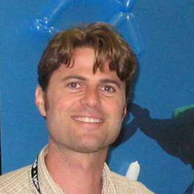

```{r setup, include=FALSE}
knitr::opts_chunk$set(echo = TRUE)
```



I am an environmental informatician, having focused on marine spatial ecology. I am currently offering consulting services and lecturing at the Bren School of Environmental Science & Management. I was the senior analyst for the Ocean Health Index, a research project housed at the National Center for Ecological Analysis and Synthesis. I recently completed a PhD at Duke University in the Marine Geospatial Ecology Lab. I worked on Marine Geospatial Ecology Tools, OBIS-SEAMAP marine animal observation geoportal, Census of Marine Life Map & Viz, and predictive distribution modeling of cetaceans.
