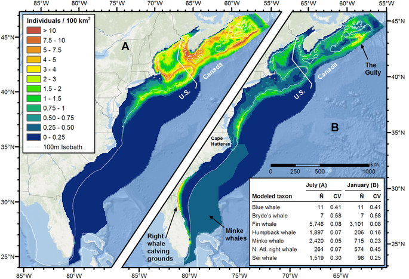
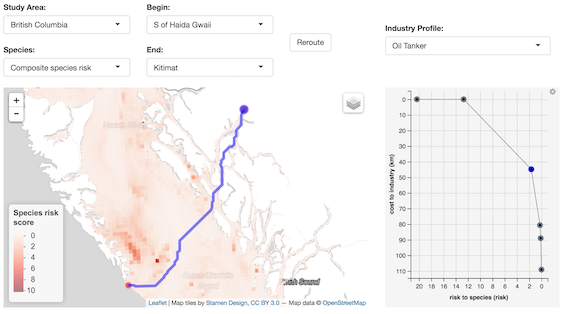
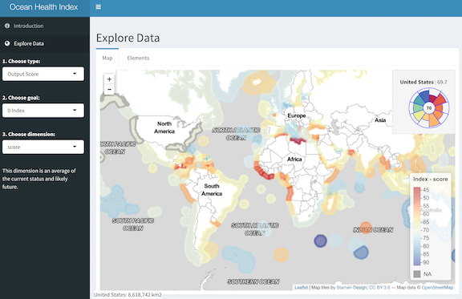

```{r setup, include=FALSE}
knitr::opts_chunk$set(echo = TRUE)
library(vembedr) # https://github.com/ijlyttle/vembedr
```

<!---
- **Machine Learning**

  - iNaturalist applying to imagery. MBON.
-->

Here are some research highlights. For a full list of publications, please see my [CV](http://www.bdbest.org/cv).

## Species Distribution Modeling

### Cetaceans in US Atlantic

[**Habitat-based cetacean density models** for the U.S. Atlantic and Gulf of Mexico (2015 Version)](http://seamap.env.duke.edu/models/Duke-EC-GOM-2015/) ([Roberts, Best _et al_ 2016](http://www.nature.com/articles/srep22615))

[](http://seamap.env.duke.edu/models/Duke-EC-GOM-2015/)

<p class="caption">Figure 5 from the paper showing the predicted mean density of baleen whales in July (A) and January (B) for the East Coast region.</p>

### Marine Mammals in British Columbia

Updated **marine mammal distribution and abundance estimates** in coastal British Columbia ([Best _et al_ 2015](https://archive.iwc.int/pages/download_progress.php?ref=5745&ext=pdf))


  
<p class="caption">Extracted from Figure 7 in the paper showing the relative distribution (e) and overall abundance estimates for the inner waters of British Columbia.</p>

## Spatial Decision Support Frameworks

For these spatial decision support frameworks, I implemented an interactive visualization whereby the map, plot and table are synchronized with each other, and can be interactively explored to highlight sites or routes.

### Siting Offshore Wind Energy

[**Siting** offshore wind energy to minimize impacts on birds in space and whales in time](http://shiny.env.duke.edu/bbest/siting/)

[](http://shiny.env.duke.edu/bbest/siting/)
    
<p class="caption">Sites on the map (10 km^2^ pixels) in the US Mid-Atlantic are colored according to the average utility depicted in the tradeoff plot to: maximize profitability to offshore wind energy development (net present value in US$, on normalized scale) on y axis, and minimizing bird sensitivity on x axis (based on 20 bird species distributions summed and weighted by sensitivity to collision and displacement, also on a normalized scale). Click a site on the map to see the cetaceans sensitivity over time, so that episidic events that impart high acoustic energy underwater (seismic air gun surveying and pile driving) can be scheduled at times when endangered whales, such as the North Atlantic Right Whale, are generally absent.</p>

### Routing Ships around Whale Hotspots

[**Routing** ships to minimize whale strikes](http://shiny.env.duke.edu/bbest/consmap/)

[](http://shiny.env.duke.edu/bbest/consmap/)
    
<p class="caption">Routes between starting and end points are selectable from the drop-down selections as ports and major entry points to British Columbia, or arbitary start and end points can be entered. Routes are then visible in the interactive map based on varying levels of avoidance of marine mammal hotspots as derived by a summing across marine mammal density surfaces and weighting by conservation concern. This uses a prescriptive least-cost routing approach rather than post-hoc evaluation of proposed routes.</p>
  
## Connectivity
  
### Larval Connectivity in Baja California by Habitat Type

Habitat-specific **larval dispersal and marine connectivity**: implications for spatial conservation planning ([Anadón et al 2013](http://www.esajournals.org/doi/abs/10.1890/ES13-00119.1))
    


### Larval Dispersal Animation

**Larval dispersal modeling** example of grouper spawning in the Gulf of California using [Marine Geospatial Ecology Tools](http://mgel.env.duke.edu/mget)

`r embed_youtube(id="WBPdztdnPos", width=400, height=200)`

## Web Portal Development

### OBIS-SEAMAP

[OBIS-SEAMAP](http://seamap.env.duke.edu/) **biodiversity portal** of marine mammal, seabird and sea turtle observations

[](http://seamap.env.duke.edu/)

### Ocean Health Index

[**Ocean Health Index**](http://ohi-science.org/): global and subcountry portals

[](http://ohi-science.org/chl/app/)

portal  | links
--------|-------
Global  | [data](https://github.com/OHI-Science/ohi-global), [website](http://www.oceanhealthindex.org/), [app](http://ohi-science.nceas.ucsb.edu/ohi-shiny2)
Belize  | [data](https://github.com/ohi-science/blz), [website](http://ohi-science.org/blz/), [app](http://ohi-science.org/blz/app/)
Chile   | [data](https://github.com/OHI-Science/chl), [website](http://ohi-science.org/chl/), [app](http://ohi-science.org/chl/app/)
Ecuador | [data](https://github.com/OHI-Science/ecu), [website](http://ohi-science.org/ecu/), [app](http://ohi-science.org/ecu/app/)

## Reproducible Science

Please see my [Teaching](teaching.html) page, particularly for [Environmental Informatics](http://ucsb-bren.github.io/env-info).


  