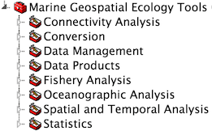

```{r setup, include=FALSE}
knitr::opts_chunk$set(echo = TRUE)
```

## MGET

I started developing some helper functions to enable communication between R and ArcGIS (ArcRstats) for teaching Conservation GIS at Duke with Dr. Patrick Halpin, and Jason Roberts has subsequently developed the robust [Marine Geospatial Ecology Tools](http://mgel.env.duke.edu/mget) ([Roberts, Best et al 2010](http://www.sciencedirect.com/science/article/pii/S1364815210000885)).
    


<p class="caption">Lead developer Jason Roberts (right), myself (left), advisor Dr. Patrick Halpin (center left) are awarded with special achievement by sole proprietor of ESRI Jack Dangermond (center right).</p>



<p class="caption">Screenshot of the toolbox. Each of the toolsets listed expands into many tools within.</p>
  
  
## [OBIS-SEAMAP](http://seamap.env.duke.edu/)

[OBIS-SEAMAP](http://seamap.env.duke.edu/) is a biodiversity portal of marine mammal, seabird and sea turtle observations

[](http://seamap.env.duke.edu/)

## Ocean Health Index

For the [**Ocean Health Index**](http://ohi-science.org/), I developed the back end data infrastructure and front end visualizations for global and subcountry portals, all using open-source software (ie R) and free web services (ie Github).

[](http://ohi-science.org/chl/app/)

portal  | links
--------|-------
Global  | [data](https://github.com/OHI-Science/ohi-global), [website](http://www.oceanhealthindex.org/), [app](http://ohi-science.nceas.ucsb.edu/ohi-shiny2)
Belize  | [data](https://github.com/ohi-science/blz), [website](http://ohi-science.org/blz/), [app](http://ohi-science.org/blz/app/)
Chile   | [data](https://github.com/OHI-Science/chl), [website](http://ohi-science.org/chl/), [app](http://ohi-science.org/chl/app/)
Ecuador | [data](https://github.com/OHI-Science/ecu), [website](http://ohi-science.org/ecu/), [app](http://ohi-science.org/ecu/app/)
